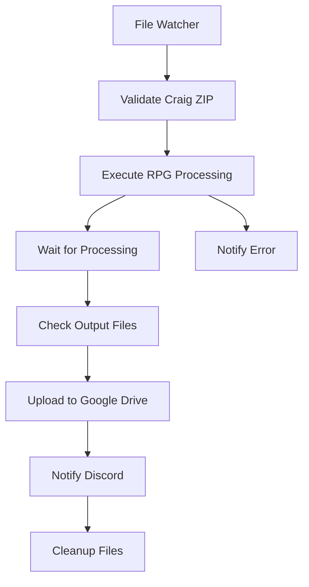

# 🚀 Guia Completo de Automação RPG Notes com N8N

## 📋 **Índice**
1. [Setup Inicial](#setup-inicial)
2. [Configuração Docker](#configuração-docker)
3. [Configuração N8N](#configuração-n8n)
4. [Workflow Automation](#workflow-automation)
5. [Teste e Validação](#teste-e-validação)
6. [Troubleshooting](#troubleshooting)

---

## 🎯 **Setup Inicial**

### **1. Preparação do Ambiente**

```bash
# 1. Clone o repositório
git clone https://github.com/YBraga35/rpgnotes.git
cd rpgnotes

# 2. Crie diretórios necessários
mkdir -p logs docker n8n-workflows shared-files

# 3. Configure variáveis de ambiente
cp .env.example .env
```

### **2. Configuração do .env**

```bash
# Edite o arquivo .env com seus valores
nano .env

# Obrigatórios:
GEMINI_API_KEY=your_gemini_api_key_here
DISCORD_WEBHOOK_URL=https://discord.com/api/webhooks/YOUR_WEBHOOK
GOOGLE_DRIVE_FOLDER_ID=your_drive_folder_id

# Opcionais mas recomendados:
N8N_BASIC_AUTH_PASSWORD=senha_segura_aqui
```

---

## 🐳 **Configuração Docker**

### **1. Estrutura de Arquivos**

```
rpgnotes/
├── Dockerfile                    # ✅ Criado
├── docker-compose.yml            # ✅ Criado  
├── docker/
│   └── requirements.txt          # ✅ Criado
├── n8n-workflows/
│   └── rpg-automation-full.json  # ✅ Criado
└── .env                          # ⚠️ Configure suas keys
```

### **2. Build e Start**

```bash
# Build da imagem customizada
docker-compose build

# Iniciar serviços
docker-compose up -d

# Verificar status
docker-compose ps

# Logs em tempo real
docker-compose logs -f n8n
```

### **3. Verificação da Instalação**

```bash
# Testar Python no container N8N
docker exec -it n8n-rpg-automator python3 --version

# Testar Whisper
docker exec -it n8n-rpg-automator python3 -c "import whisper; print('Whisper OK')"

# Testar FFmpeg
docker exec -it n8n-rpg-automator ffmpeg -version | head -1
```

---

## ⚙️ **Configuração N8N**

### **1. Acesso Inicial**

```bash
# Acesse N8N no navegador
http://localhost:5678

# Credenciais (configuradas no docker-compose.yml):
Usuário: admin
Senha: rpg_notes_2025  # Mude no .env!
```

### **2. Import do Workflow**

1. **Acesse N8N** → Menu **Workflows**
2. **Import from file** → Selecione `n8n-workflows/rpg-automation-full.json`
3. **Ative o workflow** (toggle no canto superior direito)
4. **Configure credenciais**:
   - Google Drive API
   - Discord Webhook URL

### **3. Configuração das Credenciais**

#### **Google Drive:**
1. N8N → **Credentials** → **Add Credential**
2. Escolha **Google Drive OAuth2 API**
3. Configure com sua conta Google
4. Teste a conexão

#### **Discord Webhook:**
1. Discord → Server Settings → Integrations → Webhooks
2. Create Webhook → Copy URL
3. Cole no arquivo `.env` na variável `DISCORD_WEBHOOK_URL`

---

## 🔄 **Workflow Automation**

### **1. Fluxo Completo**



### **2. Componentes do Workflow**

| Step | Node | Função | Erro Handling |
|------|------|--------|---------------|
| 1 | File Watcher | Monitora `downloads/` | Retry automático |
| 2 | Validate Craig | Verifica se é craig.zip | Skip non-Craig files |
| 3 | Execute Processing | Roda Python script | Error notification |
| 4 | Wait | Aguarda processamento | Timeout configurable |
| 5 | Check Output | Verifica .md gerados | Retry se vazio |
| 6 | Upload Drive | Salva no Google Drive | Continue on error |
| 7 | Notify Discord | Envia notificação | Optional step |
| 8 | Cleanup | Remove temp files | Always execute |

### **3. Configurações do Workflow**

```json
{
  "settings": {
    "timezone": "America/Sao_Paulo",
    "saveManualExecutions": true,
    "callerPolicy": "workflowsFromSameOwner",
    "errorWorkflow": {
      "active": true
    }
  }
}
```

---

## 🧪 **Teste e Validação**

### **1. Teste Manual do Script**

```bash
# Teste direto no container
docker exec -it n8n-rpg-automator bash

# Navegue para o diretório
cd /workspace/rpgnotes

# Teste modo automático
python3 main.py --auto-mode \
  --input-file "downloads/test.craig.zip" \
  --language pt \
  --campaign OOTDL \
  --template detailed
```

### **2. Teste do Workflow N8N**

1. **Coloque um arquivo teste**: `cp test.craig.zip downloads/`
2. **Monitore logs**: `docker-compose logs -f n8n`
3. **Verifique execução**: N8N → Executions
4. **Verifique outputs**: Pasta `output/` e Google Drive

### **3. Validação Completa**

```bash
# Checklist de validação
echo "🔍 VALIDAÇÃO DO SISTEMA"
echo "======================="

# 1. Container rodando
docker ps | grep n8n-rpg-automator && echo "✅ Container ativo" || echo "❌ Container parado"

# 2. N8N acessível
curl -f http://localhost:5678 >/dev/null 2>&1 && echo "✅ N8N acessível" || echo "❌ N8N inacessível"

# 3. Python funcional
docker exec n8n-rpg-automator python3 --version >/dev/null 2>&1 && echo "✅ Python OK" || echo "❌ Python erro"

# 4. Whisper instalado
docker exec n8n-rpg-automator python3 -c "import whisper" 2>/dev/null && echo "✅ Whisper OK" || echo "❌ Whisper erro"

# 5. Diretórios existem
docker exec n8n-rpg-automator ls -la /workspace/rpgnotes/downloads >/dev/null 2>&1 && echo "✅ Diretórios OK" || echo "❌ Diretórios erro"

echo "======================="
```

---

## 🚀 **Uso em Produção**

### **1. Fluxo Normal de Uso**

```bash
# 1. Sistema já configurado e rodando
docker-compose ps

# 2. Coloque arquivo craig.zip na pasta downloads/
cp sessao_nova.craig.zip downloads/

# 3. O sistema detecta automaticamente e processa
# 4. Receba notificação no Discord quando concluir
# 5. Arquivos .md estarão no Google Drive
```

### **2. Monitoramento**

```bash
# Logs em tempo real
docker-compose logs -f n8n

# Status dos containers
docker-compose ps

# Uso de recursos
docker stats n8n-rpg-automator

# Arquivos gerados recentemente
find output/ -name "*.md" -mtime -1
```

### **3. Manutenção**

```bash
# Restart dos serviços
docker-compose restart

# Update da imagem
docker-compose pull
docker-compose up -d

# Limpeza de containers antigos
docker system prune -f

# Backup dos dados N8N
docker cp n8n-rpg-automator:/home/node/.n8n ./backup-n8n/
```

---

## 🔧 **Troubleshooting**

### **Problemas Comuns**

#### **1. N8N não inicia**
```bash
# Verificar logs
docker-compose logs n8n

# Problemas de permissão
sudo chown -R 1000:1000 ./
docker-compose restart
```

#### **2. Python não encontrado**
```bash
# Verificar PATH no container
docker exec -it n8n-rpg-automator echo $PATH

# Rebuildar imagem
docker-compose build --no-cache
```

#### **3. Whisper não funciona**
```bash
# Testar instalação
docker exec -it n8n-rpg-automator pip list | grep whisper

# Reinstalar se necessário
docker exec -it n8n-rpg-automator pip install --upgrade openai-whisper
```

#### **4. File Watcher não detecta arquivos**
```bash
# Verificar permissões da pasta
ls -la downloads/

# Verificar se N8N consegue acessar
docker exec -it n8n-rpg-automator ls -la /workspace/rpgnotes/downloads/
```

#### **5. Google Drive upload falha**
- Verificar credenciais OAuth2
- Reautorizar se necessário
- Verificar ID da pasta do Drive

### **Debug Avançado**

```bash
# Entrar no container para debug
docker exec -it n8n-rpg-automator bash

# Executar manualmente para testar
cd /workspace/rpgnotes
python3 main.py --help

# Verificar variáveis de ambiente
env | grep -E "(GEMINI|DISCORD|GOOGLE)"

# Testar conectividade
ping -c 1 api.openai.com
ping -c 1 generativelanguage.googleapis.com
```

---

## 📊 **Monitoramento e Métricas**

### **1. Logs Estruturados**
```bash
# Ver logs de automação
tail -f logs/automation.log

# Filtrar apenas erros
grep "ERROR" logs/automation.log

# Ver últimas execuções
grep "workflow automático" logs/automation.log | tail -10
```

### **2. Métricas de Performance**
```bash
# Tempo médio de processamento
grep "Processamento concluído" logs/automation.log | \
  awk '{print $1, $2}' | \
  tail -10

# Taxa de sucesso
grep -c "✅" logs/automation.log
grep -c "❌" logs/automation.log
```

### **3. Alertas e Notificações**
- Discord: Sucesso e falhas
- Logs: Detalhes técnicos
- N8N Dashboard: Execuções visuais
- Drive: Arquivos organizados por data

---

## 🎯 **Próximos Passos**

### **Implementações Futuras**
1. **Webhook triggers** para integração externa
2. **Multiple campaigns** support automático
3. **Advanced error recovery** com retry inteligente
4. **Performance metrics** dashboard
5. **Mobile notifications** via app

### **Otimizações**
1. **Faster-whisper** para performance
2. **Parallel processing** múltiplos arquivos
3. **Smart caching** para reprocessamento
4. **Auto-scaling** baseado em carga

---

**✨ Sistema 100% automatizado! Configure uma vez, use para sempre!** 🎲